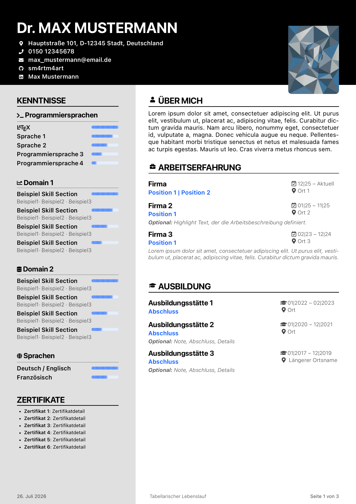
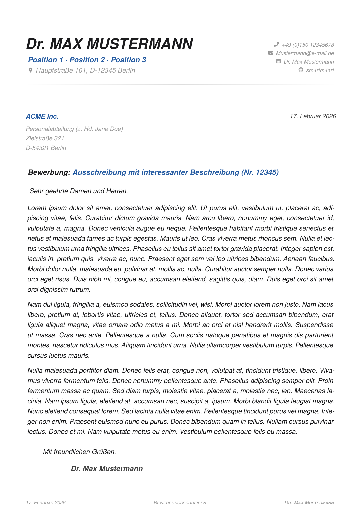
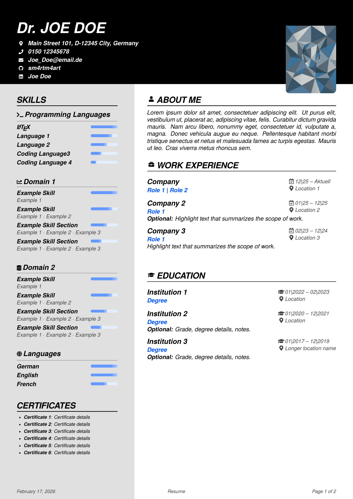
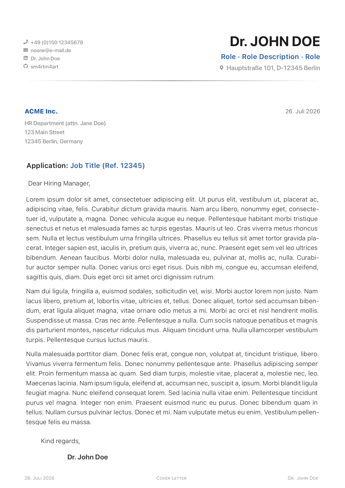

# Modern CV & Cover Letter — LaTeX Template

A modular, bilingual CV and cover-letter system for XeLaTeX.
Designed for maintainability, ATS compatibility, and GitHub/Overleaf publication.

## Preview

> Preview images are generated automatically by CI after each push to `main`.

| German CV | German Cover Letter |
|:---------:|:-------------------:|
|  |  |

| English CV | English Cover Letter |
|:----------:|:--------------------:|
|  |  |

## Why this project

- **Modular architecture**: CV logic is split into focused class modules instead of a monolithic `.cls`.
- **Unified design tokens**: Fonts, colors, and logging shared between CV and cover letter via `adjustment.cls`.
- **Bilingual templates**: Ready-to-use German and English starter templates.
- **ATS support**: Date normalization and `ActualText` accessibility for Applicant Tracking Systems.
- **GitHub-ready**: Public-safe placeholders, PII guard, and CI/CD pipeline.

## Repository structure

```text
modern_cv/
├── common/cls/
│   ├── shared_cls/
│   │   ├── adjustment.cls          # Fonts, colors, logging (shared)
│   │   └── ats.cls                 # ATS accessibility & date normalization
│   ├── cv/
│   │   ├── main_cv.cls             # CV document class
│   │   ├── defaults_cv.cls         # CV geometry and spacing
│   │   ├── i18n_cv.cls             # Localized labels (de/en)
│   │   ├── layout_cv.cls           # Page layers, footer, body layout
│   │   └── components_cv.cls       # Header, sections, entries, skill bars
│   └── cover_letter/
│       ├── main_cover_letter.cls   # Cover letter document class
│       └── defaults_coverletter.cls # Cover letter geometry and locale
├── applications/
│   ├── _template_de/
│   │   ├── MOCK_Lebenslauf.tex
│   │   └── MOCK_Bewerbungsanschreiben.tex
│   └── _template_en/
│       ├── MOCK_curriculum_vitae.tex
│       └── MOCK_cover_letter.tex
├── images/                          # Photo placeholder
├── scripts/
│   ├── new_application.sh           # Create new application from template
│   └── pii_guard.sh                 # PII leak scanner
├── docs/previews/                   # Auto-generated PDF preview images
├── .github/workflows/ci.yml        # GitHub Actions CI
├── .pre-commit-config.yaml          # Pre-commit hooks
└── .chktexrc                        # chktex configuration
```

## Requirements

- TeX distribution with `xelatex` (TeX Live 2024+ / MacTeX recommended)
- **Fonts**: SF Pro Text & SF Pro Display (macOS default, or install from Apple)
  - Fallback: TeX Gyre Heros (bundled with TeX Live) — used automatically if SF Pro is unavailable
- Font Awesome 5 package (via TeX distribution)
- Shell environment for scripts (macOS/Linux)

## Quick start

1. Create a new application folder:
   ```bash
   bash scripts/new_application.sh "Company" "Role_ID1234" de
   ```
2. Edit the `.tex` files in `applications/Company/Role_ID1234/`.
3. Compile with XeLaTeX (run twice for correct page references):
   ```bash
   xelatex MOCK_Lebenslauf.tex && xelatex MOCK_Lebenslauf.tex
   ```
4. Place final PDFs in the `sendouts/` folder.

## Customization

### Colors

All colors are defined in `adjustment.cls` and can be overridden in your `.tex` file:

```latex
% Main accent color (tags, skill bars, section dividers)
\definecolor{highlight}{HTML}{0055FF}

% Optional overrides:
%\colorlet{accent}{highlight}       % Entry titles (default: black)
%\colorlet{heading}{black}          % Section headings
%\colorlet{body}{black}             % Body text
%\colorlet{headerbarcolor}{black}   % CV header background
%\colorlet{headerfontcolor}{white}  % CV header text
%\colorlet{highlightbarcolor}{palegray} % CV sidebar background
```

**Color palette reference:**

| Name                | Default    | Purpose                           |
| ------------------- | ---------- | --------------------------------- |
| `highlight`         | `#2e457e`  | Main accent: tags, bars, dividers |
| `accent`            | `black`    | Entry titles, bold headings       |
| `heading`           | `black`    | Section heading text              |
| `body`              | `black`    | Main body text                    |
| `headerbarcolor`    | `black`    | CV header background              |
| `headerfontcolor`   | `white`    | CV header text                    |
| `highlightbarcolor` | `palegray` | CV sidebar background             |

### Fonts

Fonts are configured in `adjustment.cls`:

- **Primary**: SF Pro Text (body), SF Pro Display (headings)
- **Fallback**: TeX Gyre Heros (auto-detected if SF Pro is missing)

A warning is logged when falling back: `[CV-WARN] SF Pro Text not found — using TeX Gyre Heros fallback.`

### Footer

**CV footer** (max 2 pages, configured in `.tex`):

```latex
\makecvfooter
  {\today}                          % Left: date
  {Tabellarischer Lebenslauf}       % Center: page 1 label
  {Detaillierte Arbeitserfahrung}   % Center: page 2 label
  {}                                % Right: auto-detected from \prefix + \name
```

### Skill bars

Two styles available (set in `.tex`):

```latex
\cvUseSkillBarStyle{segmented}  % Default: segmented bars with fade
\cvUseSkillBarStyle{classic}    % Simpler filled bars
```

Custom palette:

```latex
\cvSetSkillPalette
  {highlight!10}    % Background
  {highlight!60}    % Fill
  {highlight!30}    % Full-bar tip
  {highlight!15}    % Partial-bar tip
```

### Language

```latex
\cvSetLanguage{de}  % German labels (Seite, von, Datum, ...)
\cvSetLanguage{en}  % English labels (Page, of, Date, ...)
```

### ATS date formatting

Dates entered in compact form (e.g. `12|25 \textendash Aktuell`) are automatically
normalized for ATS parsers via `ActualText` (e.g. `12/2025 - 02/2026`).

```latex
\cvSetAtsDateMode{normalized}  % Default: machine-readable dates for ATS
\cvSetAtsDateMode{raw}         % Keep authored date tokens as-is
```

## Overleaf

1. Upload the entire repository to Overleaf.
2. Set the compiler to **XeLaTeX** (Menu > Compiler).
3. Set the desired `.tex` file as the main document.
4. Note: SF Pro fonts are not available on Overleaf. The template will automatically use TeX Gyre Heros as a fallback.

## TeXStudio tips

- Log prefixes for filtering: `[CV-INFO]`, `[CV-WARN]`, `[CV-ERROR]`, `[CV-DEBUG]`
- Debug mode: add `debug` to document class options to enable verbose output:
  ```latex
  \documentclass[debug, paper=a4]{../../common/cls/cv/main_cv}
  ```
- Warnings and errors use `\ClassWarning` and `\ClassError`, which integrate with TeXStudio's error/warning panels.

## CI/CD

### Pre-commit hooks

```bash
pip install pre-commit
pre-commit install
```

Hooks: trailing whitespace, end-of-file fixer, shellcheck, PII guard.

### GitHub Actions

The CI workflow (`.github/workflows/ci.yml`) runs on push/PR:

- Compiles all 4 templates (DE + EN, CV + cover letter) with XeLaTeX
- Converts first page of each PDF to PNG preview images
- Commits preview images to `docs/previews/` on main
- Runs chktex for LaTeX linting
- Runs PII guard to catch leaked personal data
- Runs shellcheck on scripts

## Privacy and publishing

- Templates use placeholder values by default (Mustermann, max\_mustermann@email.de, etc.).
- The PII guard script (`scripts/pii_guard.sh`) scans for phone numbers, emails, and addresses.
- Create a `.pii_blocklist` file (see `.pii_blocklist.example`) with your real personal strings.
- Company-specific folders are ignored by `.gitignore`.
- Template folders (`_template_de`, `_template_en`) stay tracked.

## `new_application.sh`

```bash
# Create German application
scripts/new_application.sh "ACME" "Data_Scientist_ID42" de

# Create with slash syntax
scripts/new_application.sh "ACME/Data_Scientist_ID42" de
```

Features:

- Copies template files (excluding build artifacts and PDFs)
- Initializes a local git repo for document version control
- Creates a `sendouts/` folder for final PDFs
- Adds a `.gitignore` for LaTeX build artifacts

## License

See `LICENSE`.
